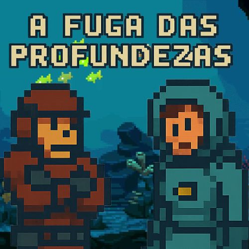

# 🦑 A Fuga das Profundezas

## 🎮 Sobre o Jogo

**A Fuga das Profundezas** é um jogo **cooperativo 2D** desenvolvido no **Construct 3**, onde **dois jogadores** precisam trabalhar juntos para sobreviver a perigosas criaturas das profundezas marítimas. Aqui, um depende totalmente do outro — sem cooperação, não há escapatória.

O jogo foi criado com foco em **trabalho em equipe**, **coordenação** e **desafios ambientais**. Cada jogador possui funções complementares que só fazem sentido quando combinadas.

---

## 🤝 Modo Cooperativo

* 🎯 Dois jogadores simultâneos
* 🔄 Dependência total entre as funções dos personagens
* 🧠 Obstáculos que só podem ser resolvidos em cooperação
* 🐙 Criaturas marinhas e ameaças emergindo das profundezas

---

## 🗂️ Estrutura do Repositório

```
📁 docs/                           → Exportação HTML do jogo (versão jogável)
📁 assets/                         → Artes, sprites, imagens e logo
📄 index.html                      → Arquivo principal do jogo
📄 README.md                       → Documentação do projeto
📄 A Fuga das profundezas.c3p      → Arquivo original do c3
```

## 🎨 Arquivo Fonte do Projeto

O arquivo original do Construct 3 (.c3p) está disponível no repositório:

- **A Fuga das Profundezas.c3p**

Isso permite que qualquer pessoa abra o projeto diretamente no Construct 3 para estudo, modificação ou extensão do jogo.

---

*(A pasta `docs` é usada pelo GitHub Pages para hospedar o jogo.)*

---

## 🌐 Jogue Agora (GitHub Pages)

🔗 https://oliveiraalann.github.io/a-fuga-das-profundezas/

Assim que o GitHub Pages processar a publicação, seu jogo ficará disponível nesse link.

---

## 🕹️ Controles

### Jogador 1

* ⬅️ ➡️ Movimentação
* ⬆️ Pulo
* SPACE Atirar

### Jogador 2

* A / D Movimentação
* W Pulo
* 0 Atirar (NumPad)


## 🛠️ Tecnologias Utilizadas

* 🚀 **Construct 3**
* 🎨 Sprites e assets personalizados
* 🌐 HTML5 export
* 💻 Git & GitHub para versionamento

---

## 📸 Capturas de Tela




### Gameplay


---

## 📦 Como Rodar Localmente

1. Baixe o repositório:

```bash
git clone https://github.com/OliveiraAlann/a-fuga-das-profundezas
```

2. Entre na pasta `docs`.
3. Abra o arquivo:

```
index.html
```

4. O jogo rodará diretamente no navegador.

---

## 📣 Créditos

* 👨‍💻 **Desenvolvimento:** Alan Oliveira (OliveiraAlann)
* 🧩 **Conceito e Mecânicas:** Criadas do zero
* 🎮 **Inspiração:** Jogos cooperativos como *It Takes Two* e experiências coop de plataforma

---

## ⭐ Contribuições

Sugestões são bem-vindas! Abra uma *issue* com ideias de melhoria, bugs encontrados ou novos recursos.

Se gostou do projeto, **deixe uma estrela ⭐ no repositório!**

---

## 🐙 A aventura te espera!

Escape das profundezas… se conseguir 😄
